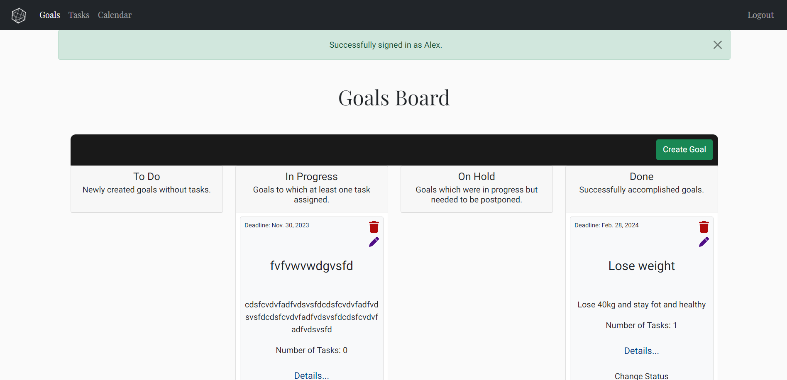
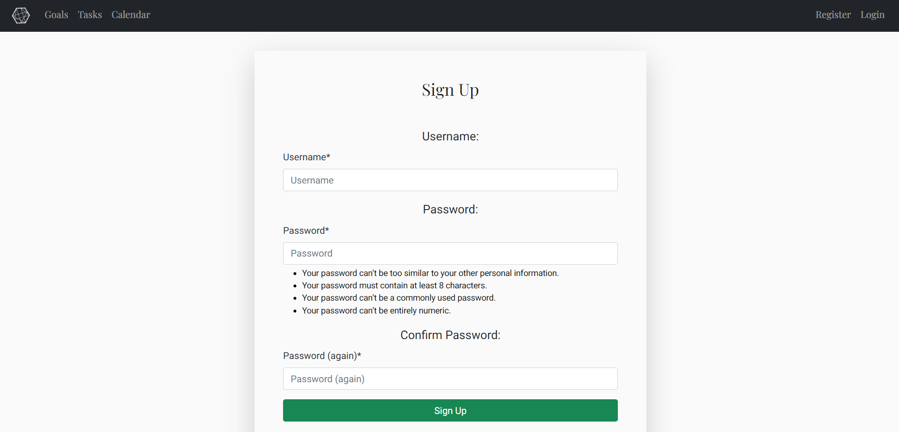

# Planner App (Task Manager)
The Planner App is a game-changer for anyone looking to set and achieve their goals. This web-based platform is designed to simplify the goal-setting process. It allows you to create, prioritize, and break down your goals into manageable tasks, while also providing the flexibility to schedule your activities. Plus, with in-depth goal statistics, you'll gain a clear view of your achievements and areas for improvement. Whether you're a student, professional, or goal-oriented individual, this app is your pathway to success.

## Planning & Development
- __Target audience__
    - Students: The Planner App is ideal for students of all ages looking to manage their academic goals, such as completing assignments, preparing for exams, or achieving personal development milestones.

    - Professionals: Career-focused individuals can benefit from the app by setting and tracking career-related objectives, managing projects, and enhancing their time management skills.

    - Entrepreneurs: Entrepreneurs and small business owners can use the app to organize and prioritize their business goals, create action plans, and measure their progress toward success.

    - Goal-Oriented Individuals: Anyone with personal aspirations, whether related to fitness, hobbies, or self-improvement, can harness the Planner App to plan, execute, and monitor their goals effectively.

    - Time Management Enthusiasts: Those interested in improving their time management skills can use the app to schedule tasks, set deadlines, and optimize their daily routines.

    - Productivity Seekers: Individuals seeking to boost their productivity and accomplish more in less time can find value in the app's task management and progress tracking features.

- __App Objectives__
    - Empower Goal Achievement:
        - Enable users to set, prioritize, and achieve their personal and professional goals effectively. Provide a platform that promotes action and progress toward meaningful objectives.

    - Enhance Time Management:
        - Help users improve their time management skills by scheduling tasks and allocating time for goal-related activities. Foster efficient use of time to maximize productivity and goal accomplishment.

    - Improve Accountability:
        - Encourage users to take ownership of their goals by breaking them down into actionable tasks and to-do lists. Facilitate tracking and monitoring of progress, creating a sense of responsibility for goal outcomes.

    - Provide Valuable Insights:
        - Offer goal statistics and data-driven feedback to help users gain a realistic view of their achievements and areas for improvement. Enable users to make data-informed decisions about their goals and time allocation.

    - Foster Versatility:
        - Cater to a diverse user base, including students, professionals, entrepreneurs, and goal-oriented individuals. Offer a user-friendly and intuitive web-based platform accessible from various devices.

    - Encourage Consistency:
        - Cultivate the habit of consistent goal setting and achievement, helping users build a lifelong practice of pursuing their aspirations.

    - Support Self-Improvement:
        - Enable users to not only achieve specific goals but also enhance their personal development, productivity, and time management skills.

    - Deliver Convenience:
        - Provide a convenient and accessible tool for goal planning and tracking that fits seamlessly into users' daily routines.

- __User Stories__
    - Task Management
        - As a user, I want to break down my goals into actionable tasks and create to-do lists, allowing me to plan the steps needed to achieve my goals.
    - Progress Tracking
        - As a user, I want to track my progress on each goal, so I can stay motivated and ensure I'm making consistent strides toward achieving my objectives.
    - Time Management
        - As a user, I want to be able to schedule specific activities and allocate time to work on my goals, helping me manage my time effectively.
    - Goal Statistics
        - As a user, I want to see statistics on goals achieved and those that were not, giving me insights into my performance and areas for improvement.
    - Versatile User Base
        - As a user, I want the app to cater to different types of goals, whether they are academic, career-related, personal, or hobby-related.
    - Convenience and Accessibility
        - As a user, I want to be able to access the app from various devices through a web-based platform, ensuring convenience and flexibility in managing my goals.
    - Cultivating Consistency
        - As a user, I want the app to encourage consistency in my goal-setting and achievement, helping me establish a habit of pursuing my aspirations.
    - Personal Development
        - As a user, I want the app to not only help me achieve specific goals but also support my personal development, productivity, and time management skills.

- __Features to be implemented__
    - Goal Board: Create and prioritize your goals in one place.
    - Todo Lists: Break down your goals into actionable tasks and to-do lists.
    - Progress Tracking: Monitor your progress towards each goal.
    - Time Management: Schedule specific activities and allocate time to achieve your goals effectively.
    - Goal Statistics: Gain insights with statistics on achieved and missed goals.

- __Wireframes__

  

Authentication wireframes

     
     
     

  

  

Goals Board wireframes

    
    
    

  

  

Tasks wireframes

    
    
    

  

  

Calendar wireframes

    
    
    

  

  

Account wireframes

    
    
    

  

- __Models__
    - A PostgreSQL SQL database is utilized. Three Django database models have been established, each containing a user field serving as a foreign key connected to the default Django User model.
    - The 'Goal' and 'Task' models maintain a one-to-many relationship, with the 'Task' model possessing a 'goal' field acting as a foreign key referencing the 'Goal' table. Additionally, the 'Task' and 'Scheduled Tasks' tables exhibit a one-to-many relationship, where the 'task' field in the 'ScheduledTask' table is a foreign key associated with the 'Task' model.
    - The 'Goal' model contains the following fields:
        - user: foreign key referencing the default Django User model with cascade deletion
        - title: character field with a maximum length of 50 characters
        - slug: slug field with a maximum length of 200 characters
        - description: text field with a maximum length of 2500 characters
        - status: choice field with the following options: 'ToDo', 'In Progress', 'On Hold' and 'Completed'
        - created_at: date field with a default value of the current date
        - updated_at: date field with a default value of the current date
        - expected_deadline: date field
    - The 'Task' model contains the following fields:
        - user: foreign key referencing the default Django User model with cascade deletion
        - goal: foreign key referencing the 'Goal' model with cascade deletion
        - title: character field with a maximum length of 50 characters
        - slug: slug field with a maximum length of 200 characters
        - description: text field with a maximum length of 2500 characters
        - completed: boolean field with a default value of 'False'
        - created_at: date field with a default value of the current date
    - The 'ScheduledTask' model contains the following fields:
        - user: foreign key referencing the default Django User model with cascade deletion
        - task: foreign key referencing the 'Task' model with cascade deletion
        - slug: slug field with a maximum length of 200 characters
        - date: date field
        - start_time: time field
        - end_time: time field
        - completed: boolean field with a default value of 'False'

- __Colors__

The chosen color palette represents a deliberate and meticulous selection aimed at fostering an environment of simplicity and comfort for all users. Each color was thoughtfully chosen to maintain a minimalist and visually unobtrusive interface, prioritizing ease of comprehension and user focus within the application.

    - The application utilized the following color palette:
        - #023685: Used as the link color.
        - #000000: Predominantly employed as the text color due to its high contrast.
        - #025702: Designated for marking completed tasks in the calendar.
        - #8B0000: Reserved for tasks yet to be done in the calendar.
        - #eeeeee: Applied to denote today's date in the calendar and when hovering over dates.
        - #DAA520: Designated for highlighting the selected day in the calendar.
        - #ffffff: Utilized for the logo, text panel, and social links.
        - #fafafa: Chosen as the overall background color.
        - #500e86: Allocated for the edit icon.
        - #b10b0b: Designated as the delete icon color.

- __Fonts__
The project's font selection comprises 'Playfair Display' and 'Roboto'. 'Playfair Display' is designated for the main headings, footer and the navigation menu to evoke a sense of seriousness and visual elegance. 'Roboto' has been incorporated specifically to enhance legibility.

This choice is intended to establish a formal tone and improve readability. The deliberate juxtaposition of 'Playfair Display' and 'Roboto' serves a dual purpose: creating visual distinction and ensuring content clarity within the project's framework.

    - Playfair Display
    - Roboto

- __Technologies__
    - Framework
      - Django

    - Languages:
        - Python
        - HTML
        - CSS
        - JavaScript
		
    - Databases:
        - PostgreSQL
    
    - Libraries:
        - Bootstrap 5
        - Font Awesome
        - Google Fonts
        - Django Crispy Forms
        - Django Allauth
        - Django Extensions
        - Gunicorn
        - Psycopg2
        - Whitenoise

- __Agile Methotology__

In developing my Task Manager App using Django, the implementation of Agile methodology was both a challenge and a guiding framework. As a solo developer navigating a new technology landscape, the Agile principles of adaptability and iterative progress became my cornerstone.

 - Agile Adaptation and Solo Development Challenges:
    - Agile methodologies, inherently designed for team collaboration, presented unique challenges in a solo development environment. Estimating tasks accurately within this framework was intricate, especially while acquainting myself with Django's complexities. The Agile structure demanded constant adaptation, a process complicated by the solitary nature of my work and the nuances of a new technology stack.

 - Strategic Sprint Adjustments and Agile Principles:
    - To align Agile principles with my solo development needs, I adopted an adaptive approach. Initially, I found myself frequently refining the structure of sprints due to the novelty of Django. However, as I progressed, the need for caution and strategic planning became apparent. While traditional Agile discourages mid-sprint changes, I maximized efforts on high-priority tasks, deviating to manage uncertainties arising from a new technology landscape.

 - Iterative Learning and Agile Efficiency:
    - As my proficiency in Django improved, so did my grasp of task estimations. This iterative learning process allowed me to plan subsequent sprints with greater precision. Evolving beyond mere task completion, I ensured a more nuanced and controlled development process. Agile, as a guiding philosophy, encouraged adaptability in my approach, fostering continuous improvement and efficiency in task estimation and project planning.

 - Refinement in Agile Sprint Planning:
    - Transitioning from rigid sprint structures, I embraced Agile flexibility, emphasizing task completion over predefined timeframes. This strategic shift allowed me to navigate uncertainties more effectively. Notably, in the project's final phase, my refined estimation process under the Agile umbrella ensured efficient allocation of time, culminating in the successful completion of the Task Manager App.

 - Future Iterations and Agile Integration:
    - Armed with a comprehensive understanding of Django and refined Agile practices, I am poised to integrate Agile principles more seamlessly into future iterations. The adaptive journey within Agile, while initially marked by adjustments and unconventional tactics, has been instrumental in my learning trajectory. My newfound confidence in Django and a strengthened Agile foundation will undoubtedly shape more efficient and structured sprint planning processes in future iterations of the Task Manager App.

 - Kanban board: https://github.com/users/OleksiyLa/projects/2

## Features
## Future Features
## Testing

### Manual Testing

#### Authentication

 - Form validation is handled by Django. The following tests were conducted to ensure the authentication process is working as intended.

 - When accessing the website, it automatically redirects to the login page.
    

   
 - If incorrect data is submitted in any field, the system displays error messages to indicate the errors. Specifically, an error message highlighted in red appears under each erroneous input field and above the form, just under title, to highlight the mistake.

 - If the user enters an incorrect username or password, the system displays an error message to indicate the error. Specifically, an error message highlighted in red appears above the form, just under title, to highlight the mistake. The system intentionally displays an error message solely below the 'Sign In' title, deliberately omitting specific field-related error messages. This design choice aims to avoid indicating which data entry—username or password—was incorrect.

    
 - If the user enters the correct username and password, the system redirects to the 'Goals Board' page.

    
 - If the user clicks the 'Sign Up' link, the system redirects to the 'Sign Up' page.

 - If the user types incorrect data in any field, the system displays error messages to indicate the errors. Specifically, an error message highlighted in red appears under each erroneous input field and above the form, just under title, to highlight the mistake.

 - Upon successful registration, the system redirects to the 'Goals Board' page.

 - If the user clicks logout at the rigth top corner, the system redirects to the 'Sign Out' page to confirm logout.

 - Upon confirmation, the system redirects to the 'Sign In' page.

## Bugs
## Deployment
 - __Deployment Steps__
    - The Task Manager App was deployed to Heroku using the following steps:
        - Create a virtual environment and install Django.
            - python -m venv myenv
            - myenv\Scripts\activate
            - Install Django using pip install Django
        - Create a project and app.
            - django-admin startproject project_name
            - cd project_name
            - python manage.py startapp app_name
        - Heroku setup
            - Log in to Heroku or create an account if required.
            - Click "Create new app".
            - Select the relevant region.
            - Enter a unique app name.
            - Click "Create app".
        - Update Django settings for Heroku.
            - Ensure DEBUG is set to False.
            - Update ALLOWED_HOSTS to include your Heroku app's domain.
            - Update the DATABASES configuration to use dj_database_url for the Heroku PostgreSQL database.
            - Add logic for Heroku-specific configurations, e.g., handling static files.
        - Install dependencies.
        - Prepare requirements file.
            - Use pip3 freeze > requirements.txt to generate a requirements.txt file listing the Python dependencies for your project.
        - Create a Procfile.
            - Create a Procfile to declare what commands are run by your app's dynos on the Heroku platform. For example, for a Django project, it might contain: web: gunicorn your_app_name.wsgi.
        - Push project to GitHub.
            - Push your project to a GitHub repository.
        - Configure environment variables.
            - Scroll down to the "Config Vars" section.
            Click "Reveal Config Vars".
            Add the following environment variables:
            DATABASE_URL: Link to your PostgreSQL database.
            PORT: Set the value to 8000.
            SECRET_KEY: Set the Django secret key for your application.
        - Set buildpack.
            - Scroll down to the buildpacks section of the settings page.
            Click "Add buildpack".
            Select "Python" and save changes.
        - Deployment configuration.
            - Navigate to the "Deploy" tab.
            Connect your Heroku app to the GitHub repository containing your project.
            Choose the branch to deploy.
        - Deploy to Heroku.
            - Trigger the deployment process in Heroku either manually or set up automatic deployments.
            Initiate the deployment process in Heroku.
            Monitor the build logs to ensure successful deployment
        - Access live application.
            - Once deployed, click "View" in Heroku to access your live application.

## Credits

### Content
- The Roboto and Playfair Display fonts were obtained from Google Fonts: https://fonts.google.com

### Media
- All SVG icons, including the favicon, were sourced from FontAwesome and Bootstrap icons: 
    - https://fontawesome.com
    - https://icons.getbootstrap.com/

### Frameworks and Libraries
- Django Docs: https://docs.djangoproject.com/en/4.2/
- Bootsrap5: https://getbootstrap.com/docs/5.3/getting-started/introduction/

### README
- The color palette images featured in the README was sourced from the website http://colormind.io/
- The text content in the README was composed with the assistance of ChatGPT: https://chat.openai.com
- The validation image for HTML were captured from: https://validator.w3.org/
- The validation image for CSS were captured from: https://jigsaw.w3.org/css-validator/
- The validation image for JS were captured from: https://jshint.com/
- The validation image for Python were captured from: https://pep8ci.herokuapp.com/#
- Database model image was created with the assistance of Draw Sql: https://drawsql.app/
